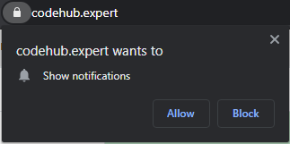

# CSE TIET
---
### TIMETABLE
### Website: [codehub.expert](https://codehub.expert)
---

   

This is the repo of CSE class **timetable** which will give **notification** 5 mins before the the class start with the class link to join.

---
**Resources:** Google excel sheet API - **https://sheetdb.io/apis**

---
**Note:** Notification will only come when you allow the permission which will ask on opening website.

